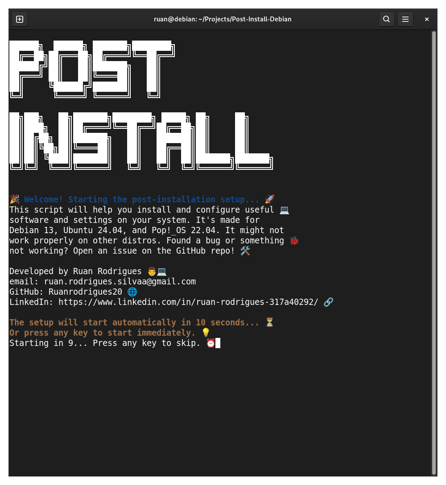
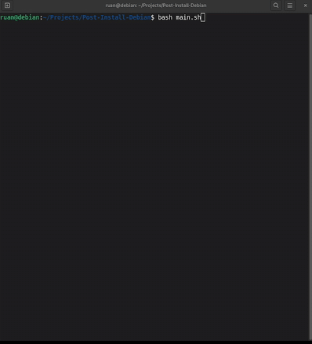

# 🛠️ Post-Installation Script for Debian/Ubuntu/Pop!_OS

Welcome to the **Post-Installation Script** project! This repository contains a modular and automated post-installation script designed to simplify your setup process after installing a fresh Linux system (Debian 13, Ubuntu 24.04, or Pop!\_OS 22.04). It installs essential software, applies system configurations, themes, aliases, wallpapers, and even checks for updates.

---

## 📸 Preview

<!-- Place screenshots or GIFs here -->
<p align="center">
  
</p>

---
## 🎬 Demo

<p align="center">
  
</p>
o

## 🧠 How It Works

1. `main.sh` is the entry point.
2. All setup logic is modularized in the `scripts/` directory.
3. `main.sh` sources these scripts automatically and runs the appropriate functions in order.
4. The script displays a logo, welcome message, internet check, update checker, and step-by-step installation process.
5. Once everything is completed, a summary is shown.

---

## 📂 Project Structure

```

.
├── main.sh                  # Entry point script
├── VERSION                  # Script version (used for update checks)
├── scripts/                 # Modular logic
│   ├── aliases.sh
│   ├── core.sh
│   ├── downloads.sh
│   ├── firefox.sh
│   ├── flatpaks.sh
│   ├── gtk\_theme.sh
│   ├── install\_debs.sh
│   ├── snaps.sh
│   ├── tlp.sh
├── wallpapers/              # Wallpapers and wallpaper setter
│   ├── wallpapers.sh
│   └── \*.jpg / \*.png
├── LICENSE.txt              # Project license
└── README.md                # You're here!

````

---

## 🚀 Getting Started

### 1. Clone the Repository

```bash
git clone https://github.com/Ruanrodrigues20/Post-Install-Debian.git
cd Post-Install-Debian
````

### 2. Make It Executable

```bash
chmod +x main.sh
```

### 3. Run the Script

```bash
./main.sh
```

> ⚠️ **Note**: Make sure to review and customize the scripts to fit your Linux distribution and preferences. Some actions require `sudo`.

---

## ✅ Features

* 🔧 Core packages and tools installation
* 🌐 Firefox `.deb` installer
* 🎨 GTK Theme configuration
* 🖼️ Random wallpaper setter
* ⚡ Power optimization with TLP
* 📦 Flatpak, Snap, and `.deb` support
* 🧰 Useful aliases and CLI enhancements
* 💻 Git and user directory setup
* 🔍 Internet connection verification
* 🆕 Auto update checker

---

## 🔄 Update Checker

When executed, the script:

* Reads the current local version from `VERSION`
* Compares it with the remote version from the GitHub repository
* Prompts the user to update if a newer version is found

This ensures you’re always running the latest setup logic.

---

## 📋 Summary Example

At the end of execution, a summary like the following is displayed:

```
===== 📋 Post-Installation Summary =====
✔ Internet connection verified
✔ System updated
✔ Dependencies installed
✔ DEB packages installed
✔ GNOME tools installed
✔ Firefox (DEB) installed
✔ Flatpak applications installed
✔ Snap packages installed
✔ Extra downloads completed
✔ Wallpapers applied
✔ GTK theme configured
✔ Useful aliases added
✔ Git configured
✔ TLP configured for power saving
✔ User directories set up
🎉 All tasks completed successfully!
```

---

## 👤 About the Author

**Ruan Rodrigues**
📧 Email: [ruan.rodrigues.silvaa@gmail.com](mailto:ruan.rodrigues.silvaa@gmail.com)
🌐 GitHub: [Ruanrodrigues20](https://github.com/Ruanrodrigues20)
🔗 LinkedIn: [ruan-rodrigues](https://www.linkedin.com/in/ruan-rodrigues-317a40292/)

---

## 📜 License

This project is licensed under the terms described in the [`LICENSE.txt`](./LICENSE.txt) file.

---

## 🧠 Contributing

Feel free to fork this project and make it your own. Pull requests and feedback are welcome!

---

## 📌 To-Do (Suggestions)

* [ ] Add a GUI version (Tkinter, Zenity, etc.)
* [ ] More distro-specific options
* [ ] Internationalization (i18n)
* [ ] Restore point / backup manager

---